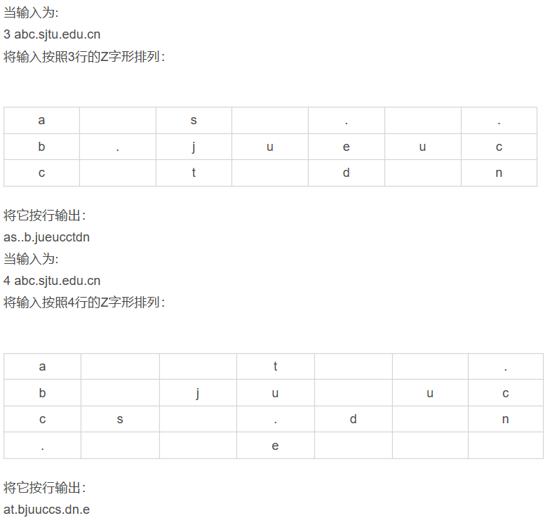

- [ 第1关：数组排序](#head1)
- [ 第2关：开灯问题](#head2)
- [ 第3关：黑色星期五](#head3)
- [ 第4关：删除重复数据（双数组版）](#head4)
- [ 第5关：删除重复数据（单数组版）](#head5)
- [ 第6关：回文数](#head6)
- [ 第7关：数字金字塔-二维数组](#head7)
- [ 第8关：寻找鞍点-二维数组](#head8)
- [ 第9关：字符转换数值](#head9)
- [ 第10关：统计元音字母个数](#head10)
- [ 第11关：查找字符](#head11)
- [ 第12关：字符重排序](#head12)
- [ 第13关：字符数统计](#head13)
- [ 第14关：寻找字符串](#head14)
- [ 第15关：查找回文字符串](#head15)
- [ 第16关：插入位置](#head16)
- [ 第17关：四则运算](#head17)
- [ 第18关：1的个数](#head18)
- [ 第19关：奇数位置的字符](#head19)
- [ 第20关：最长无重复字符串的长度](#head20)
- [ 第21关：第一次和最后一次](#head21)
- [ 第22关：插入排序](#head22)
- [ 第23关：小球碰撞](#head23)
- [ 第24关：最少点击次数](#head24)
- [ 第25关：Z字形变换](#head25)
###  第1关：数组排序

**任务描述**

本关任务：输入一个正整数 n（n<100），然后再输入 n 个整数，将它们从大到小排序后输出。

**编程要求**

根据提示，在右侧编辑器补充代码，用户输入一个正整数n，然后再输入n个整数，将它们从大到小排序后输出。

**测试说明**

平台会对你编写的代码进行测试：

测试输入：`5 88 55 77 44 99` 预期输出： `99 88 77 55 44`

###  第2关：开灯问题

**任务描述**

本关任务：有n盏灯，编号为1~n。第1个人把所有灯打开，第2个人按下所有编号为2的倍数的开关（这些灯将被关掉），第3个人按下所有编号为3的倍数的开关（其中关掉的灯将被打开，开着的灯将被关闭），依次类推。一共有k个人，问最后有哪些灯开着？

**编程要求**

根据提示，在右侧编辑器补充代码，输入正整数n和k（k≤n≤1000），从小到大输出开着的灯的编号。

**测试说明**

平台会对你编写的代码进行测试：

测试输入：`7 3` 预期输出： `1 5 6 7`

###  第3关：黑色星期五

**任务描述**

本关任务：黑色星期五是指某天既是13号又是星期五。13号在星期五比在其他日子少吗？为了回答这个问题，编写一个程序，计算每个月的13号落在周一到周日的次数。

**编程要求**

根据提示，在右侧编辑器补充代码，用户输入正整数n，n为正整数且不大于400。要求计算从1900年1月1日至1900+n-1年12月31日中13 号落在周一到周日的次数（已知1900年1月1日是星期一）。

**测试说明**

平台会对你编写的代码进行测试：

测试输入：`20` 预期输出： `34 33 35 35 34 36 33` 输出说明：以上7个数依次为星期一至星期日的天数

###  第4关：删除重复数据（双数组版）

**任务描述**

本关任务：编写一个能删除数组中重复数据的程序。

**编程要求**

根据提示，在右侧编辑器补充代码，输入一组数据（不超过1000个），“利用一个新的数组”保存其中唯一的元素出现，按照原顺序输出所有数字的首次出现。 注意： （1）要求引入第二个数组； （2）输出数组中元素时，不再进行新的判断，只能用for(int k=0; k<n; k++) cout<<arr[k]形式； （3）如果需要读入所有输入的整数，可以采用while(cin>>x)这种形式。其表示循环读入数据，并将其放入变量x中。当cin读不到新的数据时候，循环终止。在键盘输入时，可以通过ctrl+z结束输入，此时cin>>x结果为false。

**测试说明**

平台会对你编写的代码进行测试：

测试输入：`1 2 3 2 1` 预期输出： `1 2 3`

###  第5关：删除重复数据（单数组版）

**任务描述**

本关任务：编写一个能删除数组中重复数据的程序

**编程要求**

根据提示，在右侧编辑器补充代码，用户输入一组数据（不超过1000个），删除掉其中的重复数据，输出数组中剩余元素个数（假设为n个）,并按照原顺序输出所有数字的首次出现。 注意：不允许引入第二个数组；输出数组中元素时，不再进行新的判断，只能用for(int k=0; k<n; k++) cout<<arr[k]形式

**测试说明**

平台会对你编写的代码进行测试：

测试输入：`1 2 3 2 1` 预期输出： `3 1 2 3`

###  第6关：回文数

**任务描述**

本关任务：回文数是指从左向右念和从右向左念都一样的数。如 12321 就是一个典型的回文数。给定一个进制 B（2≤B≤20，由十进制表示），求出所有的大于等于 1 小于等于 200（十进制下）且它的平方用 B 进制表示是回文数的数。用“A”，“B”，“C”…表示 10，11，12 等等。

**编程要求**

根据提示，在右侧编辑器补充代码，输入整数 B（B 由十进制表示），输出分成多行，每行输出两个 B 进制的数字，第二个数是第一个数的平方，且第二个数是回文数。

**测试说明**

平台会对你编写的代码进行测试：

测试输入：`8` 预期输出： 
`1 1` 
`2 4` 
`3 11` 
`6 44` 
`11 121` 
`13 171` 
`33 1331` 
`101 10201` 
`111 12321` 
`117 14141` 
`121 14641` 
`123 15351` 
`303 112211`

###  第7关：数字金字塔-二维数组

**任务描述**

本关任务：观察下面的数字金字塔，寻找一个算法查找从最高点到底部任意处结束的路径，使路径经过的数字的和最大。每一步可以走到左下方的点也可以到达右下方的点。        7       3 8      8 1 1     2 7 4 4    4 5 2 6 5 在上面的例子中，从 7 到 3 到 8 到 7 到 5 的路径产生了最大的数字和。

**编程要求**

根据提示，在右侧编辑器补充代码，编写一个程序，首先输入数字金字塔层次数R（1≤R≤10），接着输入这个数字金字塔每行包含的整数（所有整数大于等于0且小于100），输出计算出来的最大的和。

提示：设置一个两维数组 f，f[i，j] 表示从最高点（最高点为第 1 层）到达第 i 层第 j 个位置时经过路径数字的最大和，则 f[i+1，j]+=Max{ f[i，j-1]，f[i，j]}（1≤i≤r-1，1≤j≤i）。请注意边界值的处理，f[i，0]=0。

**测试说明**

平台会对你编写的代码进行测试：

测试输入：`5 7 3 8 8 1 1 2 7 4 4 4 5 2 6 5` 预期输出： `30` 输入说明：与任务描述中的图形对应

###  第8关：寻找鞍点-二维数组

**任务描述**

本关任务：在矩阵中，一个元素在所在行中是最大值，在所在列中是最小值，则被称为鞍点（Saddle point）。求所给矩阵的鞍点

**编程要求**

根据提示，在右侧编辑器补充代码，用户输入两个正整数 m 和 n（m，n≤10），然后输入该 m 行 n 列矩阵 mat 中的元素，如果找到 mat 的鞍点，就输出它的下标；如果找到多个鞍点，则分行输出它们的下标（行下标小的鞍点优先输出）；否则，输出“Not Found”。

**测试说明**

平台会对你编写的代码进行测试：

测试输入：
`3 3 5 1 2 1 1 1 2 1 5` 
预期输出： 
`mat[1][0]=1`
`mat[1][1]=1` 
`mat[1][2]=1`

###  第9关：字符转换数值

**任务描述**

本关任务：输入一个字符串（少于80个字符），把字符串中所有的数字字符转换为整数，去掉其他字符。

**编程要求**

根据提示，在右侧编辑器补充代码，输入一个字符串（少于80个字符），输出转换后的整数值的2倍（不考虑负值，不会超过int的范围）

**测试说明**

平台会对你编写的代码进行测试：

测试输入：`pro56gr am93 m4in g` 预期输出： `113868` 输出说明：56934*2=113868

###  第10关：统计元音字母个数

**任务描述**

本关任务：输入一个字符串（少于80个字符），统计并输出其中元音字母（AEIOUaeiou）的个数（不区分大小写）。

**编程要求**

根据提示，在右侧编辑器补充代码，用户输入一个字符串（少于80个字符），统计并输出其中元音字母（AEIOUaeiou）的个数

**测试说明**

平台会对你编写的代码进行测试：

测试输入：`I have an apple` 预期输出： `6`

###  第11关：查找字符

**任务描述**

本关任务：编写一个程序，首先输入一个字符串（少于80个字符），接着再输入一个字符，查找该字符在字符串中是否存在。如果找到，则输出该字符串在字符串中所对应的最大下标（下标从0开始）；否则输出“Not Found”

**编程要求**

根据提示，在右侧编辑器补充代码，用户输入一个字符串（少于80个字符），接着再输入一个字符，输出该字符串在字符串中所对应的最大下标（下标从0开始），或者否则输出“Not Found”

**测试说明**

平台会对你编写的代码进行测试：

测试输入： `Hello, world! ` `l` 预期输出： `10`

###  第12关：字符重排序

**任务描述**

本关任务：输入一个字符串（少于80个字符），去掉重复的字符后，按照字符的ASCII码值从大到小输出。

**编程要求**

根据提示，在右侧编辑器补充代码，用户输入一个字符串（少于80个字符），去掉重复的字符后，按照字符的ASCII码值从大到小输出。

**测试说明**

平台会对你编写的代码进行测试：

测试输入：`ya7bb2tizx4m55n9q2` 预期输出： `zyxtqnmiba97542`

###  第13关：字符数统计

**任务描述**

本关任务：编写一个程序，从键盘上输入一篇英文文章，统计出其中的英文字母（不区分大小写）、数字和其他非空白字符的个数。

**编程要求**

根据提示，在右侧编辑器补充代码，用户首先输入英文文章的行数n（1≤n≤10），接着依次输入n行内容（每行少于80个字符）。要求统计出其中的英文字母（不区分大小写）、数字和其它非空白字符的个数。

**测试说明**

平台会对你编写的代码进行测试：

测试输入： `6` `We focus on essay generation, which is a challenging ` `task that generates a paragraph-level text ` `with multiple topics. Progress towards understanding`  `different topics and expressing diversity in this`  `task requires more powerful generators and richer`  `training and evaluation resources.`

预期输出： `英文字母：241` `数字：0` `其他字符：4`

###  第14关：寻找字符串

**任务描述**

本关任务：输入两个字符串str1和str2，查找str2在str1里首次出现的位置。

**编程要求**

根据提示，在右侧编辑器补充代码，用户输入两个字符串str1和str2，每个字符串是一行，查找str2在str1里首次出现的位置。如果str2在str1中不存在，则输出-1。 注意：（1）每一行不超过160个字符，可以包含任意字符；（2）不使用字符串比较的库函数。

**测试说明**

平台会对你编写的代码进行测试：

测试输入： `To be, or not to be: that is the question,`  `To` 预期输出： `0`

###  第15关：查找回文字符串

**任务描述**

本关任务：编写一个程序，寻找一篇英文文章中最长的回文字符串。回文字符串是具有回文特性的字符串：即该字符串从左向右读，与从右向左读都一样。

**编程要求**

根据提示，在右侧编辑器补充代码，用户输入的文章不会超过10000字符。这个文件可能一行或多行，但是每行都不超过80个字符（不包括最后的换行符）。在寻找回文时只考虑字母 ‘A’ - ‘Z’ 和 ‘a’ - ‘z’ ，忽略其他字符（例如：标点符号，空格等）。输出的第一行应该包括找到的最长的回文的长度。然后是这个回文的原文（没有除去标点符号，空格等），但是从字母开始，到字母结束。如果有多个回文长度都等于最大值，输出最前面出现的那一个。

**测试说明**

平台会对你编写的代码进行测试：

测试输入： `Hello,world! Dlrow,olleh!` `Helloh,world! Dlrow,holleh!` `Helloah,world! Dlrow,haolleh!` `Hellohwaha,world! Dlrow,ahawholleh!`

预期输出： `38` `w,holleh!` `Helloah,world! Dlrow,haolleh!` `Hellohw`

###  第16关：插入位置

**任务描述**

本关任务：已知一个规模为n的有序整数数组，再输入整数x，判断x是否在数组中，如果是，则输出相应下标，如果否，则x插入数组哪个位置能够使数组仍然有序。

**编程要求**

根据提示，在右侧编辑器补充代码，输入正整数n(n<1000)，再输入n个有序整数以构成数组，再输入整数x，判断x是否在数组中，如果是，则输出相应下标，如果否，则求出x插入数组哪个位置能够使数组仍然有序。尽量提高算法效率。

**测试说明**

平台会对你编写的代码进行测试：

测试输入：`4 1 3 5 6 5` 预期输出： `2` 输出说明：数组为{1，3，5，6}，5的下标为2

测试输入：`4 1 3 5 6 2` 预期输出： `1` 输出说明：数组为{1，3，5，6}，2如果放在第1位则仍然有序

###  第17关：四则运算

**任务描述**

本关任务：设计程序，用户输入一个正整数的四则运算表达式，输出相应的结果

**编程要求**

根据提示，在右侧编辑器补充代码，用户输入一个正整数的四则运算表达式（每个表达式只有一个运算符，且无需检查表达式合法性），输出相应的结果（在int的表示范围内），如输入23+54，则输出77，如果是整数除法，只需输出商即可，不用求余数

**测试说明**

平台会对你编写的代码进行测试：

测试输入：`23+54` 预期输出： `23+54=77`

###  第18关：1的个数

**任务描述**

本关任务：A是一个n行n列的0-1矩阵(n<20)，每行的1都在0的前面，如何确定哪一行的1最多。

**编程要求**

根据提示，在右侧编辑器补充代码，先输入n，然后输入整个矩阵，输出1的个数最多的行的序号。如果有多行1的个数都是最多，输出序号最小的。思考一下如何提高程序执行效率。

**测试说明**

平台会对你编写的代码进行测试：

测试输入： `3` `1 1 0` `1 1 1` `1 0 0` 预期输出： `1` 输出说明：由于第一行有3个1，在所有的行中最多

###  第19关：奇数位置的字符

**任务描述**

本关任务：编写一个程序，能够将所给字符串奇数位置的字符重新构成一个新的字符串并输出。

**编程要求**

根据提示，在右侧编辑器补充代码，首先输入一个字符串（少于80个字符），将此字符串奇数位置的字符构成一个新的字符串并输出。

**测试说明**

平台会对你编写的代码进行测试：

测试输入：`123456` 预期输出： `246`

###  第20关：最长无重复字符串的长度

**任务描述**

本关任务：输入只包含小写字母的非空字符串，求最长无重复字母的字符串的长度

**编程要求**

根据提示，在右侧编辑器补充代码，输入只包含小写字母的非空字符串，长度小于100，寻找没有重复字母的子串，求这一类子串的最大长度并输出

**测试说明**

平台会对你编写的代码进行测试：

测试输入：`abcabcbb` 预期输出： `3` 输出说明：子串abc长度为3

###  第21关：第一次和最后一次

**任务描述**

本关任务：对于一个给定的有序数组，求出目标值x在该数组中第一次和最后一次出现的位置

**编程要求**

根据提示，在右侧编辑器补充代码，用户先输入n，然后输入一个规模为n的有序数组，再输入目标值下，求出目标值x在该数组中第一次和最后一次出现的位置，如果x未出现在数组中，输出两个-1。请尽量提高计算效率。

**测试说明**

平台会对你编写的代码进行测试：

测试输入：`6 5 7 7 8 8 10 8` 预期输出： `3 4` 输出说明：数组为{5,7,7,8,8,10}

###  第22关：插入排序

**任务描述**

本关任务：根据如下插入排序基本思想编程，对整数数组排序：

一个数显然是有序的，因此规模为1的排序问题能够求解； 如果能够为n-1个数排序，那么当有n个数时，只需先将前n-1个数排好序，再将最后一个数插入前面这n-1个有序数列中的合适位置即可 这样我们就得到了插入排序算法。

例如要对3，6，2，4从小到大排序

考虑规模为1的问题，即数字3，一个数显然是有序的 规模为1的问题求解完毕后，加入新的数字6，将其放在3后面，得到序列3，6，从而解决了规模为2的问题 规模为2的问题求解完毕后，加入新的数字2，将其放在3前面，得到序列2，3，6，从而解决了规模为3的问题 规模为3的问题求解完毕后，加入新的数字4，将其放在2和3中间，得到序列2，3，4，6，从而解决了规模为4的问题，排序过程结束。

**编程要求**

根据提示，在右侧编辑器补充代码，输入包含一个表示元素数量的正整数n（0<n<=100)和n个整数（int取值范围内），输出排序后的元素，数字之间用空格分隔

**测试说明**

平台会对你编写的代码进行测试：

测试输入：`3 3 2 -1` 预期输出： `-1 2 3`

###  第23关：小球碰撞

**任务描述**

本关任务：在一个长度为L米的平台上，放着N个质量相同的小球，每个小球的初始速度都为1m/s，小球的运动方向按照摆上去的顺序间隔着向左或者向右，第一个摆上去小球的运动方向向右。我们认为小球的体积很小，碰撞满足动量守恒定律，且发生完全弹性碰撞，碰撞不发生能量损失，碰撞的时间非常短暂可以忽略。问平台上的第一个和最后一个掉落的小球分别是在什么时候掉下去的。

**编程要求**

根据提示，在右侧编辑器补充代码，用户首先输入2个整数，表示小球的数量N(<10000)和平台的长度L。然后输入N个整数，分别表示小球在平台上的位置，按照小球摆上去的顺序给出，平台的左端点位置为0，右端点位置为L。保证开始的时候没有两个小球在一个位置。输出两个整数，分别表示小球最早掉下去的时间和最晚掉下去的时间，用空格分隔。

**测试说明**

平台会对你编写的代码进行测试：

测试输入：`5 10 1 3 5 7 9` 预期输出： `1 9`

###  第24关：最少点击次数

**任务描述**

本关任务：5*5的格子中，每个格子代表一盏灯，点击一次，此格子和上下左右相邻的共5个格子中的灯的状态会发生反转，亮着的会熄灭，熄灭的会点亮。如何用最少的点击次数使所有的灯都点亮？（亮灯用1表示，熄灭状态用0表示）

**编程要求**

根据提示，在右侧编辑器补充代码，输入五行，每行五个数值(0或1)，表示当前格子的状态。输出对于输入数据中对应的当前状态最少需要几步才能使25个格子都变亮。如果不能使25个格子都变亮，输出-1。尽量提高计算效率。

**测试说明**

平台会对你编写的代码进行测试：

测试输入： `00111` `01011` `10001` `11010` `11100` 预期输出： `3` 输出说明：点击(0,0)，（2,2）和（4,4）

###  第25关：Z字形变换

**任务描述**

本关任务：输入一个字符串以及Z字形的行数，将它按照z字形重排后输出 

**编程要求**

根据提示，在右侧编辑器补充代码，先输入一个正整数n（代表Z字形的行数），然后是需要重排的字符串，字符串长度不超过30，输出为一行，即按照Z字形重排后的字符串

**测试说明**

平台会对你编写的代码进行测试：

测试输入：`3 abc.sjtu.edu.cn` 预期输出： `as..b.jueucctdn`

